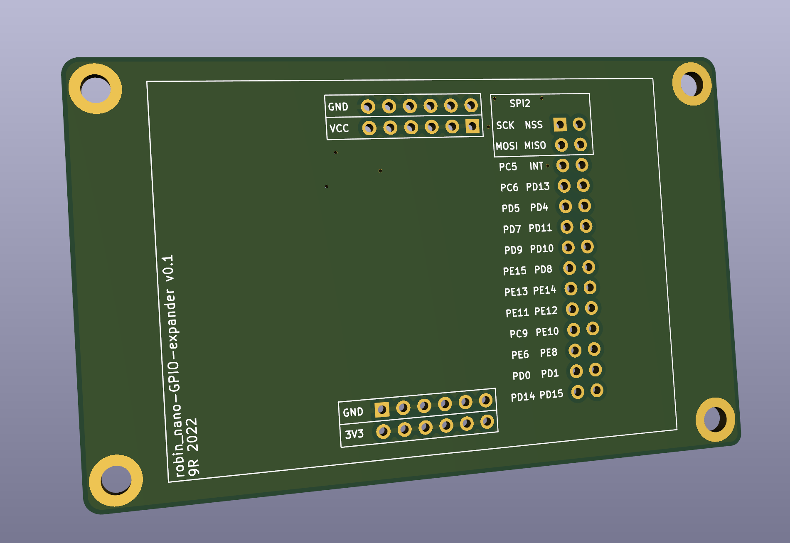
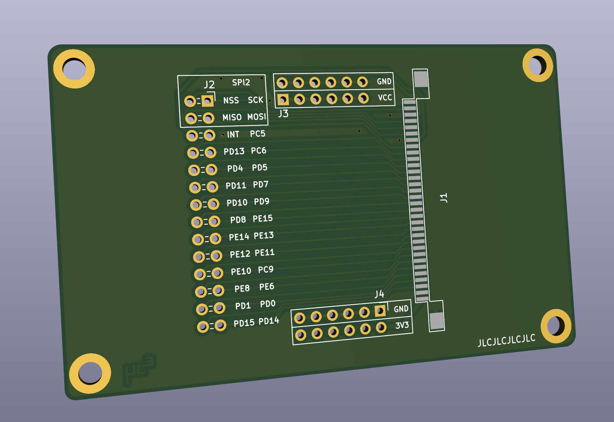
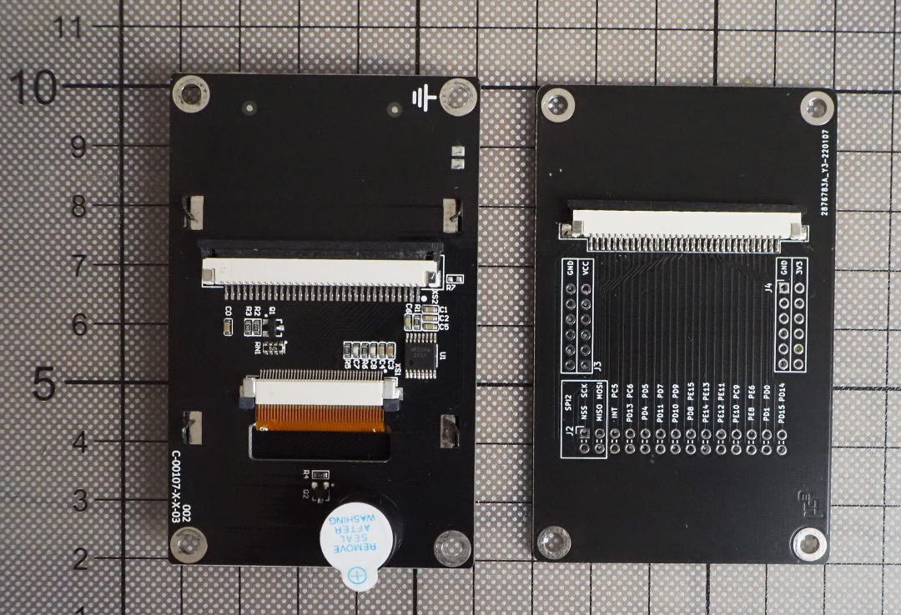
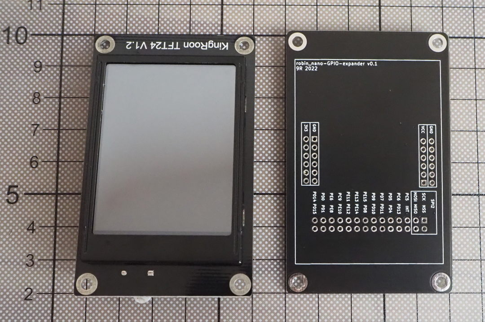
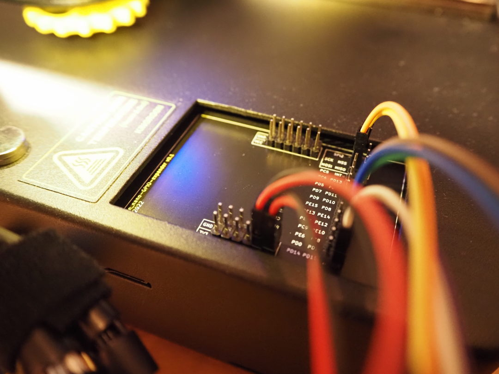

# GPIO Expander for KP3S

This PCB is as a replacement for the original LCD-PCB of the KP3S and can be 
installed in the same location. It will expose additional GPIOs. It is meant
to be used with alternative firmware like klipper, where the original LCD-PCB 
can not be used.

## Features

* exposes SPI2 (can be used to connect a klipper compatible display)
* exposes 23 additional GPIOs
* access to 5V, 3.3V and GND to power additional, low current sensors
* the original flexible flat cable can be used to connect to the mainboard

## Required Parts

* 1x 32 pin FFC connector (bottom contact, 1mm pitch)

optional:
* pin/socket headers (2.54 pitch, 2x 6x2 + 1x 14x2 for full assembly)
* 15cm 32 pin flexible flat cable (pitch 1mm)

## Example Config

An example config for klipper with an SSD1306 OLED display and a rotary encoder 
can be found [here](https://github.com/9R/Klipper_KP3S).

## Manufacturing

Use [KiCAD](https://kicad.org) to generate production files for the manufacturer
of your choice.

## Pictures

#### Top

#### Bottom

#### Next to original LCD-PCB

#### Installed in KP3S

